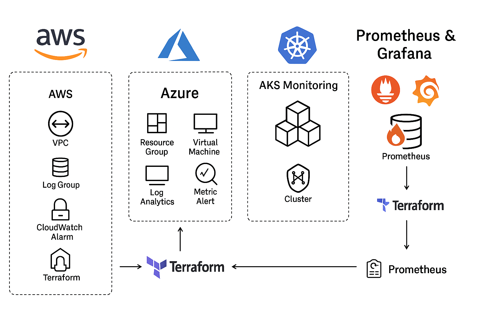

# Cloud Monitoring Automation Lab – AWS, Azure, AKS, Prometheus & Grafana.

Automated lab to provision, monitor, and alert on AWS, Azure and Kubernetes workloads using **Terraform**, **CloudWatch**, **Azure Monitor**, **Prometheus** and **Grafana**.

---

## Table of Contents
- [Overview](#overview)
- [Real-World Risk](#real-world-risk)
- [What I Built](#what-i-built)
- [Diagram](#diagram)
- [Objectives](#objectives)
  - [AWS](#aws)
  - [Azure](#azure)
  - [AKS](#aks)
  - [Grafana and Prometheus](#grafana-and-prometheus)
- [Screenshots](#screenshots)
- [Lessons Learned](#lessons-learned)
- [Notes and Limitations](#notes-and-limitations)
- [References](#references)
- [Contact](#contact)

---

## Overview

This project demonstrates a full end-to-end **Cloud Monitoring Automation** setup, integrating cloud-native monitoring tools like CloudWatch, Azure Monitor and Container Insights, with open-source observability platforms. The lab showcases infrastructure deployment with Terraform, alert configuration, workload simulation for alert validation and visualization in live dashboards, **and it's separated in 4 minilabs; AWS, Azure, AKS and Grafana + Prometheus.**

---

## Real-World Risk

Without proactive monitoring, performance degradation or resource exhaustion in production workloads can go unnoticed until they cause outages.  

**This lab addresses:**
- Delayed detection of high CPU usage or system faults.
- Lack of integrated alerting pipelines.
- Missing visualization for real-time cluster health.
- Manual, error-prone monitoring configuration.

---

## What I Built

- 4 minilabs showcasing:

**AWS CloudWatch Monitoring**
   - Terraform-provisioned AWS VPC, EC2 instance and CloudWatch alarms.
   - SNS topic with encrypted email notifications.
   - Lambda function triggered by alarms.
    
**Azure Monitor Integration**
   - Azure VM provisioned with Terraform.
   - Log Analytics Workspace and CPU alert configuration.
   - Email notifications and portal-based monitoring.
     
**AKS Cluster Monitoring**
   - AKS deployed with Terraform.
   - Container Insights and Azure Monitor alerts for Kubernetes workloads.
     
**Prometheus & Grafana on AKS**
   - Prometheus installed via Helm for metrics scraping.
   - Grafana for visualization with imported Kubernetes dashboards.
     
**Automated Testing**
   - Stress workloads to simulate CPU spikes.
   - End-to-end alert verification.

---

## Diagram

---

## Objectives

1. Provision multi-cloud infrastructure using Terraform.
2. Configure proactive monitoring and alerts for AWS, Azure and AKS.
3. Integrate open-source monitoring tools with cloud-native services.
4. Simulate workload stress to validate monitoring pipelines.
5. Visualize real-time performance metrics in Grafana.

---

## AWS
**1.1 Resource Creation**  
   - Provisioned AWS infrastructure with Terraform including VPC, subnets, EC2 instance, CloudWatch alarms and SNS topic *(Screenshot: `aws-terraform-apply-success.png`)*  

**1.2 SNS Configuration**  
   - Created SNS topic for CloudWatch alarm notifications *(Screenshot: `aws-sns-topic.png`)*
   - Verified SNS subscription confirmation email *(Screenshot: `sns-subscription-confirmation-email.png`)*  
   - SNS subscription successfully confirmed *(Screenshot: `sns-subscription-confirmed.png`)* 
   - Created a KMS key for encrypting SNS messages *(Screenshot: `aws-kms-key.png`)*  

**1.3 IAM Policy Permissions**  
   - Attached IAM policy for Lambda and API Gateway access *(Screenshot: `aws-policy-bootstrap-attached.png`)* 
   - Restricted IAM role permissions for enhanced security *(Screenshot: `aws-role-permissions-tightened.png`)*  

**1.4 CloudWatch & Lambda Alarms**  
   - Configured API Gateway to trigger Lambda functions *(Screenshot: `aws-api-gateway.png`)*  
   - Created Lambda function to process CloudWatch alarms and route to notifications *(Screenshot: `aws-lambda-alert-hub.png`)*    
   - Configured CloudWatch alarm for EC2 high CPU usage *(Screenshot: `aws-cloudwatch-alarm-cpu-high.png`)*  
   - Sent a test alert from CloudWatch to Lambda *(Screenshot: `aws-cloudwatch-lambda-test-alert.png`)*  
   - Verified Lambda action triggered by CloudWatch alarm *(Screenshot: `CloudWatch_Alarm_LambdaAction.png`)*  
   - Observed composite alarm status during simulated alert *(Screenshot: `CloudWatch_CompositeAlarm_InAlarm.png`)*  
   - Verified CloudWatch alarm active state *(Screenshot: `CloudWatch_InAlarm.png`)*  
   - Viewed Lambda configuration for alarm handling *(Screenshot: `Lambda_CreateFunction_Details.png`)*  
   - Checked CloudWatch Logs for Lambda alarm event *(Screenshot: `Lambda_Logs_AlarmEvent.png`)*  
 
**1.5 Alerts**  
   - Executed CPU stress test on EC2 instance to trigger alarm *(Screenshot: `EC2_Stress_Running.png`)*  
   - Verified email notification triggered by CloudWatch alarm *(Screenshot: `sns-alert-email.png`)*  

---

## Azure
**2.1 Terraform**  
   - Initiated Terraform deployment for Azure infrastructure *(Screenshot: `terraform_apply_start.png`)*  
   - Successfully deployed Azure resources via Terraform *(Screenshot: `terraform_apply_success.png`)*  

**2.2 Console Resources**  
   - Created Azure Resource Group for monitoring lab *(Screenshot: `azure_resource_group.png`)*  
   - Viewed VM properties in Azure portal *(Screenshot: `azure_vm_details.png`)*   
   - Connected to Azure VM via SSH *(Screenshot: `azure_vm_connect.png`)*  
   - Confirmed Azure VM deployed and running *(Screenshot: `cma-azure-vm.png`)*  
   - Monitored CPU usage from Azure portal *(Screenshot: `azure_vm_metrics_cpu.png`)*  
   - Created Log Analytics Workspace for monitoring *(Screenshot: `azure_log_analytics_workspace.png`)*  
   - Configured Azure Action Group for alerts *(Screenshot: `azure_action_group.png`)*  

**2.3 Alerts**  
   - Verified Azure Monitor email alert *(Screenshot: `azure_email_alert.png`)*  
   - Triggered high CPU alert on Azure VM *(Screenshot: `cma-cpu-high-azure.png`)*  
   - Confirmed alert resolution in Azure Monitor *(Screenshot: `azure_monitor_metric_alert_resolved.png`)*  

---

## AKS
**3.1 Preparation**  
   - Verified AKS nodes are in Ready state *(Screenshot: `AKS-Nodes-Ready.png`)*
   - Confirmed kubectl connection to AKS cluster *(Screenshot: `k8s_aks_kubectl_connected.png`)*   
   - Deployed sample NGINX application to AKS *(Screenshot: `k8s_app_deployed.png`)*  

**3.2 Monitoring and Alerts**  
   - Enabled Container Insights for AKS in Azure Monitor *(Screenshot: `k8s_monitoring_enabled.png`)*  
   - Configured high CPU usage alert for AKS workloads *(Screenshot: `k8s_alert_rule_created.png`)*  
   - Received email notification for AKS high CPU alert *(Screenshot: `aks-high-cpu-alert-email.png`)*  
   - Viewed high CPU alert in Azure portal *(Screenshot: `aks-high-cpu-alert-portal.png`)*  

---

## Grafana and Prometheus
**4.1 Prometheus**  
   - Installed Prometheus on AKS via Helm *(Screenshot: `Prometheus-Deployed.png`)*   
   - Set up port forwarding for Prometheus dashboard *(Screenshot: `prometheus_portforward.png`)*    
   - Observed CPU spike metrics in Prometheus UI *(Screenshot: `prometheus_cpu_spike.png`)*  

**4.2 Grafana**  
   - Installed Grafana on AKS via Helm *(Screenshot: `Grafana-Deployed.png`)*  
   - Set up port forwarding for Grafana dashboard *(Screenshot: `grafana_portforward.png`)*  
   - Logged into Grafana web UI *(Screenshot: `Grafana-Login.png`)*   
   - Ran Prometheus queries from Grafana Explore *(Screenshot: `grafana_explore_prometheus_query.png`)*  
   - Viewed live metrics dashboard in Grafana. *(Screenshot: `grafana_dashboard_live.png`)*  
   - Displayed CPU spike in Grafana visualizations *(Screenshot: `grafana_cpu_spike.png`)*  

**4.3 Cleanup**  
   - Initiated cleanup of AWS, Azure, AKS and monitoring stack *(Screenshot: `cleanup_all_components.png`)*
  
---

## Screenshots

*All screenshots are included in the `screenshots/` folder.*

| Step | Screenshot Filename                      | Description                                             |
|------|------------------------------------------|---------------------------------------------------------|
| 1.1  | aws-terraform-apply-success.png          | AWS Terraform deployment completed                      |
| 1.2  | aws-sns-topic.png                        | SNS topic created for CloudWatch alarm notifications    |
| 1.2  | sns-subscription-confirmation-email.png  | SNS subscription confirmation email                     |
| 1.2  | sns-subscription-confirmed.png           | SNS subscription confirmed                              |
| 1.2  | aws-kms-key.png                          | KMS key created for SNS encryption                      |
| 1.3  | aws-policy-bootstrap-attached.png        | IAM policy attached for Lambda/API Gateway              |
| 1.3  | aws-role-permissions-tightened.png       | IAM role permissions tightened                          |
| 1.4  | aws-api-gateway.png                      | API Gateway configured to trigger Lambda                |
| 1.4  | aws-lambda-alert-hub.png                 | Lambda function created for alarm handling              |
| 1.4  | aws-cloudwatch-alarm-cpu-high.png        | CloudWatch alarm created for EC2 CPU usage              |
| 1.4  | aws-cloudwatch-lambda-test-alert.png     | CloudWatch test alert sent to Lambda                    |
| 1.4  | CloudWatch_Alarm_LambdaAction.png        | Lambda action triggered by CloudWatch alarm             |
| 1.4  | CloudWatch_CompositeAlarm_InAlarm.png    | Composite alarm status in alarm                         |
| 1.4  | CloudWatch_InAlarm.png                   | CloudWatch alarm active                                 |
| 1.4  | Lambda_CreateFunction_Details.png        | Lambda function configuration details                   |
| 1.4  | Lambda_Logs_AlarmEvent.png               | Lambda logs showing alarm event                         |
| 1.5  | EC2_Stress_Running.png                   | CPU stress test running on EC2                          |
| 1.5  | sns-alert-email.png                      | SNS email alert from CloudWatch alarm                   |
| 2.1  | terraform_apply_start.png                | Azure Terraform deployment started                      |
| 2.1  | terraform_apply_success.png              | Azure Terraform deployment successful                   |
| 2.2  | azure_resource_group.png                 | Azure Resource Group created                            |
| 2.2  | azure_vm_details.png                     | Azure VM details in portal                              |
| 2.2  | azure_vm_connect.png                     | SSH connection to Azure VM                              |
| 2.2  | cma-azure-vm.png                         | Azure VM deployed and running                           |
| 2.2  | azure_vm_metrics_cpu.png                 | Azure VM CPU metrics in portal                          |
| 2.2  | azure_log_analytics_workspace.png        | Log Analytics Workspace created                         |
| 2.2  | azure_action_group.png                   | Azure Action Group configured                           |
| 2.3  | azure_email_alert.png                    | Azure Monitor email alert                               |
| 2.3  | cma-cpu-high-azure.png                   | High CPU alert triggered on Azure VM                    |
| 2.3  | azure_monitor_metric_alert_resolved.png  | Azure Monitor metric alert resolved                     |
| 3.1  | AKS-Nodes-Ready.png                      | AKS nodes ready                                         |
| 3.1  | k8s_aks_kubectl_connected.png            | kubectl connected to AKS cluster                        |
| 3.1  | k8s_app_deployed.png                     | Sample NGINX app deployed to AKS                        |
| 3.2  | k8s_monitoring_enabled.png               | Container Insights enabled for AKS                      |
| 3.2  | k8s_alert_rule_created.png               | AKS high CPU alert rule created                         |
| 3.2  | aks-high-cpu-alert-email.png             | Email notification for AKS high CPU alert               |
| 3.2  | aks-high-cpu-alert-portal.png            | High CPU alert viewed in Azure portal                   |
| 4.1  | Prometheus-Deployed.png                  | Prometheus deployed on AKS                              |
| 4.1  | prometheus_portforward.png               | Prometheus port-forward configured                      |
| 4.1  | prometheus_cpu_spike.png                 | CPU spike observed in Prometheus UI                     |
| 4.2  | Grafana-Deployed.png                     | Grafana deployed on AKS                                 |
| 4.2  | grafana_portforward.png                  | Grafana port-forward configured                         |
| 4.2  | Grafana-Login.png                        | Grafana login screen                                    |
| 4.2  | grafana_explore_prometheus_query.png     | Prometheus query executed in Grafana Explore            |
| 4.2  | grafana_dashboard_live.png               | Live metrics dashboard in Grafana                       |
| 4.2  | grafana_cpu_spike.png                    | CPU spike visualization in Grafana                      |
| 4.3  | cleanup_all_components.png               | Cleanup of AWS, Azure, AKS and monitoring stack         |

---

## Lessons Learned

- Cross-cloud monitoring requires careful configuration of IAM/Role permissions.
- Simulated workload tests are essential to ensure alerts are triggered as expected.
- Prometheus and Grafana greatly enhance Kubernetes observability beyond native cloud tools.
- Terraform allows reproducible monitoring infrastructure across different providers.
- Cleanup automation is critical to avoid cloud billing surprises.

---

## Notes and Limitations

- All deployments were made in test environments — do not deploy this setup directly into production without adjustments.
- CPU stress tests are intentionally aggressive and should not be run on shared/production systems.
- Some Grafana dashboards require adjusting variable queries to match data sources.
- Costs may incur for AWS/Azure resources if left running.

---

## References
- [Terraform Documentation](https://developer.hashicorp.com/terraform/docs)
- [AWS CloudWatch](https://docs.aws.amazon.com/cloudwatch)
- [Azure Monitor](https://learn.microsoft.com/en-us/azure/azure-monitor/)
- [Prometheus](https://prometheus.io/docs/)
- [Grafana](https://grafana.com/docs/)

---

## Contact

Sebastian Silva C. – August, 2025 – Berlin, Germany  
- [LinkedIn](https://www.linkedin.com/in/sebastiansilc/)  
- [GitHub](https://github.com/SebaSilC)  
- [sebastian@playbookvisualarts.com](mailto:sebastian@playbookvisualarts.com)
